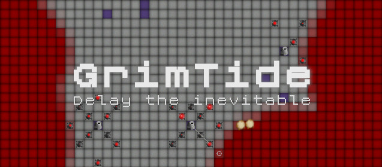

# GrimTide : Delay the Inevitable
Completed in 3 days for Ludum Dare 50. 

> The Game:

A tide of red stuff is creeping towards your base. How long can you hold off it’s implacable advance?

Build factories on purple squares to generate resources.

Use proximity mines protect your factories, and mortars to clear out the red stuff.

Prevent the red from creating new sources by shooting it’s spores out the air with missiles.

And if the worst come to worst, you always have the nukes.

> Credits:

* https://www.monogame.net/
* https://www.leshylabs.com/apps/sfMaker/
* https://www.webaudiomodules.org/wamsynths/obxd
* https://www.fontspace.com/roentgen-nbp-font-f17869
